# [](https://github.com/alejandrofsevilla/neural-network/actions/workflows/Linux.yml) [](https://github.com/alejandrofsevilla/neural-networkboost-tcp-server-client/actions/workflows/MacOs.yml)

# neural-network
Implementation of neural network class.

## Design

```mermaid
classDiagram
    class C_0004723107453516162687["options::ActivationFunctionType"]
    class C_0004723107453516162687 {
        <<enumeration>>
        Step
        Linear
        Relu
        Sigmoid
        TanH
    }
    class C_0005819293835413443314["options::CostFunctionType"]
    class C_0005819293835413443314 {
        <<enumeration>>
        Quadratic
        CostEntropy
    }
    class C_0006489356659787961387["options::OptimizationType"]
    class C_0006489356659787961387 {
        <<enumeration>>
        GradientDescend
        ADAM
        SGD
    }
    class C_0005162987213334549566["options::LayerConfig"]
    class C_0005162987213334549566 {
        +numberOfNeurons : std::size_t
    }
    class C_0009990744508583239417["options::TrainingConfig"]
    class C_0009990744508583239417 {
        +learnRate : double
        +lossGoal : double
        +maxEpoch : std::size_t
    }
    class C_0017517293265978054845["Layer"]
    class C_0017517293265978054845 {
        +Layer(std::size_t id, std::size_t numberOfInputs, std::size_t numberOfNeurons, options::ActivationFunctionType activationFunction) : void
        +activationFunction() : [const] const ActivationFunction *
        +backwardPropagate(Layer * prevLayer) : void
        +computeErrors(const Layer * nextLayer) : std::vector&lt;double&gt;
        +computeErrors(const std::vector&lt;double&gt; & targets, const CostFunction * costFunction) : std::vector&lt;double&gt;
        +computeLoss() : [const] double
        +computeOutputs() : std::vector&lt;double&gt;
        +errors() : [const] const std::vector&lt;double&gt; &
        +forwardPropagate(Layer * nextLayer) : void
        +id() : [const] std::size_t
        +inputs() : [const] const std::vector&lt;double&gt; &
        +neurons() : [const] const std::vector&lt;Neuron&gt; &
        +numberOfInputs() : [const] std::size_t
        +setErrors(const std::vector&lt;double&gt; & errors) : void
        +setInputs(const std::vector&lt;double&gt; & inputs) : void
        +updateNeuronWeights(std::size_t neuronId, double learnRate) : void
        +updateNeuronWeights(std::size_t neuronId, const std::vector&lt;double&gt; & gradients, double learnRate) : void
    }
    class C_0016029915442214150756["ActivationFunction"]
    class C_0016029915442214150756 {
        <<abstract>>
        +~ActivationFunction() : [default] void
        +operator()(double input) : [const] double*
        +derivative(double input) : [const] double*
        +instance(options::ActivationFunctionType type) : std::unique_ptr&lt;ActivationFunction&gt;$
    }
    class C_0013578780095480796457["StepActivationFunction"]
    class C_0013578780095480796457 {
        +operator()(double input) : [const] double
        +derivative(double input) : [const] double
    }
    class C_0011078890997464044819["LinearActivationFunction"]
    class C_0011078890997464044819 {
        +operator()(double input) : [const] double
        +derivative(double input) : [const] double
    }
    class C_0002817530414547552801["ReluActivationFunction"]
    class C_0002817530414547552801 {
        +operator()(double input) : [const] double
        +derivative(double input) : [const] double
    }
    class C_0011953039370874830196["SigmoidActivationFunction"]
    class C_0011953039370874830196 {
        +operator()(double input) : [const] double
        +derivative(double input) : [const] double
    }
    class C_0000064153189652549417["TanHActivationFunction"]
    class C_0000064153189652549417 {
        +operator()(double input) : [const] double
        +derivative(double input) : [const] double
    }
    class C_0018195103025728394851["CostFunction"]
    class C_0018195103025728394851 {
        <<abstract>>
        +~CostFunction() : [default] void
        +operator()(double value, double target) : [const] double*
        +derivative(double value, double target) : [const] double*
        +instance(options::CostFunctionType type) : std::unique_ptr&lt;CostFunction&gt;$
    }
    class C_0015216133785148867685["QuadraticCostFunction"]
    class C_0015216133785148867685 {
        +operator()(double value, double target) : [const] double
        +derivative(double value, double target) : [const] double
    }
    class C_0016477597730260498529["CostEntropyCostFunction"]
    class C_0016477597730260498529 {
        +operator()(double value, double target) : [const] double
        +derivative(double value, double target) : [const] double
    }
    class C_0014902208681964330340["Neuron"]
    class C_0014902208681964330340 {
        +Neuron(const Layer * owner, std::size_t id) : void
        +computeError(double target, const CostFunction * costFunction) : double
        +computeError(const Layer * nextLayer) : double
        +computeOutput() : double
        +gradients() : [const] const std::vector&lt;double&gt; &
        +id() : [const] std::size_t
        +layerId() : [const] std::size_t
        +loss() : [const] double
        +updateWeights(const std::vector&lt;double&gt; & gradients, double learnRate) : void
        +updateWeights(double learnRate) : void
        +weights() : [const] const std::vector&lt;double&gt; &
    }
    class C_0014877256980872623468["OptimizationAlgorithm"]
    class C_0014877256980872623468 {
        +~OptimizationAlgorithm() : [default] void
        +epochsCount() : [const] std::size_t
        +instance(options::OptimizationType optimization, options::CostFunctionType costFunction, const std::vector&lt;std::unique_ptr&lt;Layer&gt;&gt; & layers) : std::unique_ptr&lt;OptimizationAlgorithm&gt;$
        +loss() : [const] double
        +run(TrainingBatch batch, std::size_t maxEpoch, double learnRate, double lossGoal) : void
    }
    class C_0011803148689591493735["GradientDescendOptimizationAlgorithm"]
    class C_0011803148689591493735 {
        +GradientDescendOptimizationAlgorithm(options::CostFunctionType costFunction, const std::vector&lt;std::unique_ptr&lt;Layer&gt;&gt; & layers) : void
    }
    class C_0016586572411026969904["TrainingSample"]
    class C_0016586572411026969904 {
        +inputs : std::vector&lt;double&gt;
        +outputs : std::vector&lt;double&gt;
    }
    class C_0004972352846766595368["TrainingBatch"]
    class C_0004972352846766595368 {
    }
    class C_0006869410385549763069["TrainingReport"]
    class C_0006869410385549763069 {
        +epochs : std::size_t
        +loss : double
        +trainingTime : std::chrono::milliseconds
    }
    class C_0016902125101895250401["NeuralNetwork"]
    class C_0016902125101895250401 {
        +NeuralNetwork(std::size_t numberOfInputs) : void
        +~NeuralNetwork() : void
        +addLayer(options::LayerConfig config) : void
        +computeOutputs(const std::vector&lt;double&gt; & inputs) : std::vector&lt;double&gt;
        +train(options::TrainingConfig config, const TrainingBatch & batch) : TrainingReport
    }
    class C_0009936346703037128794["SGDOptimizationAlgorithm"]
    class C_0009936346703037128794 {
        +SGDOptimizationAlgorithm(options::CostFunctionType costFunction, const std::vector&lt;std::unique_ptr&lt;Layer&gt;&gt; & layers) : void
    }
    class C_0012912509499042389263["ADAMOptimizationAlgorithm"]
    class C_0012912509499042389263 {
        +ADAMOptimizationAlgorithm(options::CostFunctionType costFunction, const std::vector&lt;std::unique_ptr&lt;Layer&gt;&gt; & layers) : void
    }
    C_0005162987213334549566 o-- C_0004723107453516162687 : +activationFunction
    C_0009990744508583239417 o-- C_0006489356659787961387 : +optimization
    C_0009990744508583239417 o-- C_0005819293835413443314 : +costFunction
    C_0017517293265978054845 o-- C_0016029915442214150756 : -m_activationFunction
    C_0017517293265978054845 o-- C_0014902208681964330340 : -m_neurons
    C_0016029915442214150756 <|-- C_0013578780095480796457 : 
    C_0016029915442214150756 <|-- C_0011078890997464044819 : 
    C_0016029915442214150756 <|-- C_0002817530414547552801 : 
    C_0016029915442214150756 <|-- C_0011953039370874830196 : 
    C_0016029915442214150756 <|-- C_0000064153189652549417 : 
    C_0018195103025728394851 <|-- C_0015216133785148867685 : 
    C_0018195103025728394851 <|-- C_0016477597730260498529 : 
    C_0014902208681964330340 --> C_0016029915442214150756 : -m_activationFunction
    C_0014877256980872623468 --> C_0017517293265978054845 : #m_layers
    C_0014877256980872623468 o-- C_0018195103025728394851 : #m_costFunction
    C_0014877256980872623468 <|-- C_0011803148689591493735 : 
    C_0004972352846766595368 o-- C_0016586572411026969904 : +samples
    C_0016902125101895250401 o-- C_0017517293265978054845 : -m_layers
    C_0014877256980872623468 <|-- C_0009936346703037128794 : 
    C_0014877256980872623468 <|-- C_0012912509499042389263 : 

%% Generated with clang-uml, version 0.6.0
%% LLVM version Ubuntu clang version 15.0.7
```

## Requirements
* C++17 compiler.
* CMake 3.22.0
* GoogleTest 1.11.0

## Build and Install
- Clone the repository to your local machine.
   ```terminal
   git clone https://github.com/alejandrofsevilla/neural-network.git
   cd neural-network
   ```
- Build.
   ```terminal
   cmake -S . -B build
   cmake --build build
   ```
- Run tests.
   ```terminal
   ./build/tests/neural-network-tests
   ```
