# [](https://github.com/alejandrofsevilla/neural-network/actions/workflows/LinuxBuild.yml) [](https://github.com/alejandrofsevilla/neural-network/actions/workflows/LinuxBuildAndTest.yml)
# neural-network
C++ implementation of neural network class.
## Usage
### Requirements
* C++17 compiler.
* CMake 3.22.0
* GoogleTest 1.11.0
* Eigen 3
  
### Interface
```cpp
class NeuralNetwork {
public:
  explicit NeuralNetwork(std::size_t numberOfInputs);

  ~NeuralNetwork();

  std::vector<double> computeOutputs(const std::vector<double> &inputs);

  void addLayer(options::LayerConfig config);

  TrainingReport train(options::TrainingConfig config,
                       const TrainingBatch &batch);
```
### Options
```cpp
namespace options {
enum class ActivationFunctionType { Step, Linear, Relu, Sigmoid, TanH };
enum class CostFunctionType { Quadratic, CostEntropy };
enum class OptimizationType { GradientDescend, ADAM, SGD };

struct LayerConfig {
  std::size_t numberOfNeurons;
  options::ActivationFunctionType activationFunction;
};

struct TrainingConfig {
  options::OptimizationType optimization;
  options::CostFunctionType costFunction;
  std::size_t maxEpoch;
  double learnRate;
  double lossGoal;
};
```

### Build and test
- Install dependencies.
   ```terminal
   sudo apt-get update;
   sudo apt-get install libgtest-dev;
   sudo apt-get install libeigen3-dev
   ```
- Clone the repository.
   ```terminal
   git clone https://github.com/alejandrofsevilla/neural-network.git
   cd neural-network
   ```
- Build.
   ```terminal
   cmake -S . -B build
   cmake --build build
   ```
- Run tests.
   ```terminal
   ./build/tests/neural-network-tests
   ```
## Implementation

```mermaid
classDiagram
    class C_0004723107453516162687["options::ActivationFunctionType"]
    class C_0004723107453516162687 {
        <<enumeration>>
    }
    class C_0005819293835413443314["options::CostFunctionType"]
    class C_0005819293835413443314 {
        <<enumeration>>
    }
    class C_0006489356659787961387["options::OptimizationType"]
    class C_0006489356659787961387 {
        <<enumeration>>
        GradientDescend
        ADAM
        SGD
    }
    class C_0005162987213334549566["options::LayerConfig"]
    class C_0005162987213334549566 {
        +numberOfNeurons : std::size_t
    }
    class C_0009990744508583239417["options::TrainingConfig"]
    class C_0009990744508583239417 {
        +learnRate : double
        +lossGoal : double
        +maxEpoch : std::size_t
    }
    class C_0017517293265978054845["Layer"]
    class C_0017517293265978054845 {
        +errors() : [const] const Eigen::VectorXd &
        +id() : [const] std::size_t
        +inputs() : [const] const Eigen::VectorXd &
        +loss() : [const] double
        +numberOfInputs() : [const] std::size_t
        +numberOfNeurons() : [const] std::size_t
        +outputs() : [const] const Eigen::VectorXd &
        +updateErrors(const Layer & nextLayer) : void
        +updateErrorsAndLoss(const Eigen::VectorXd & targets, const CostFunction & costFunction) : void
        +updateOutputs(const Eigen::VectorXd & inputs) : void
        +updateWeights(double learnRate) : void
        +updateWeights(const Eigen::MatrixXd & gradients, double learnRate) : void
        +weights() : [const] const Eigen::MatrixXd &
        -m_errors : Eigen::VectorXd
        -m_id : const std::size_t
        -m_inputs : Eigen::VectorXd
        -m_loss : double
        -m_numberOfInputs : const std::size_t
        -m_numberOfNeurons : const std::size_t
        -m_outputDerivatives : Eigen::VectorXd
        -m_outputs : Eigen::VectorXd
        -m_weights : Eigen::MatrixXd
    }
    class C_0016029915442214150756["ActivationFunction"]
    class C_0016029915442214150756 {
        <<abstract>>
        +operator()(double input) : [const] double*
        +derivative(double input) : [const] double*
    }
    class C_0013578780095480796457["StepActivationFunction"]
    class C_0013578780095480796457 {
        +operator()(double input) : [const] double
        +derivative(double input) : [const] double
    }
    class C_0011078890997464044819["LinearActivationFunction"]
    class C_0011078890997464044819 {
        +operator()(double input) : [const] double
        +derivative(double input) : [const] double
    }
    class C_0002817530414547552801["ReluActivationFunction"]
    class C_0002817530414547552801 {
        +operator()(double input) : [const] double
        +derivative(double input) : [const] double
    }
    class C_0011953039370874830196["SigmoidActivationFunction"]
    class C_0011953039370874830196 {
        +operator()(double input) : [const] double
        +derivative(double input) : [const] double
    }
    class C_0000064153189652549417["TanHActivationFunction"]
    class C_0000064153189652549417 {
        +operator()(double input) : [const] double
        +derivative(double input) : [const] double
    }
    class C_0018195103025728394851["CostFunction"]
    class C_0018195103025728394851 {
        <<abstract>>
        +operator()(double value, double target) : [const] double*
        +derivative(double value, double target) : [const] double*
    }
    class C_0015216133785148867685["QuadraticCostFunction"]
    class C_0015216133785148867685 {
        +operator()(double value, double target) : [const] double
        +derivative(double value, double target) : [const] double
    }
    class C_0016477597730260498529["CostEntropyCostFunction"]
    class C_0016477597730260498529 {
        +operator()(double value, double target) : [const] double
        +derivative(double value, double target) : [const] double
    }
    class C_0014877256980872623468["OptimizationAlgorithm"]
    class C_0014877256980872623468 {
        #afterEpoch() : void
        #afterSample() : void
        #backwardPropagate(const std::vector&lt;double&gt; & outputs) : void
        #forwardPropagate(const std::vector&lt;double&gt; & inputs) : void
        #preprocess(TrainingBatch & batch) : [const] void
        +run(TrainingBatch batch, std::size_t maxEpoch, double learnRate, double lossGoal) : TrainingReport
        #m_epochCount : std::size_t
        #m_learnRate : double
        #m_loss : double
        #m_sampleCount : std::size_t
    }
    class C_0011803148689591493735["GradientDescendOptimizationAlgorithm"]
    class C_0011803148689591493735 {
        -afterEpoch() : void
        -afterSample() : void
        -m_averageGradients : std::vector&lt;Eigen::MatrixXd&gt;
    }
    class C_0004972352846766595368["TrainingBatch"]
    class C_0004972352846766595368 {
    }
    class C_0006869410385549763069["TrainingReport"]
    class C_0006869410385549763069 {
    }
    class C_0016902125101895250401["NeuralNetwork"]
    class C_0016902125101895250401 {
        +addLayer(options::LayerConfig config) : void
        +computeOutputs(const std::vector&lt;double&gt; & inputs) : std::vector&lt;double&gt;
        +train(options::TrainingConfig config, const TrainingBatch & batch) : TrainingReport
        -m_numberOfInputs : const std::size_t
        -m_numberOfOutputs : std::size_t
    }
    class C_0016586572411026969904["TrainingSample"]
    class C_0016586572411026969904 {
        +inputs : std::vector&lt;double&gt;
        +outputs : std::vector&lt;double&gt;
    }
    class C_0009936346703037128794["SGDOptimizationAlgorithm"]
    class C_0009936346703037128794 {
        -afterSample() : void
    }
    class C_0012912509499042389263["ADAMOptimizationAlgorithm"]
    class C_0012912509499042389263 {
        -afterSample() : void
        -computeGradients(std::size_t layerId) : Eigen::MatrixXd
        -m_momentEstimates : std::vector&lt;Eigen::MatrixX&lt;std::pair&lt;double,double&gt;&gt;&gt;
    }
    C_0005162987213334549566 o-- C_0004723107453516162687 : +activationFunction
    C_0009990744508583239417 o-- C_0006489356659787961387 : +optimization
    C_0009990744508583239417 o-- C_0005819293835413443314 : +costFunction
    C_0017517293265978054845 o-- C_0016029915442214150756 : -m_activationFunction
    C_0016029915442214150756 <|-- C_0013578780095480796457 : 
    C_0016029915442214150756 <|-- C_0011078890997464044819 : 
    C_0016029915442214150756 <|-- C_0002817530414547552801 : 
    C_0016029915442214150756 <|-- C_0011953039370874830196 : 
    C_0016029915442214150756 <|-- C_0000064153189652549417 : 
    C_0018195103025728394851 <|-- C_0015216133785148867685 : 
    C_0018195103025728394851 <|-- C_0016477597730260498529 : 
    C_0014877256980872623468 --> C_0017517293265978054845 : #m_layers
    C_0014877256980872623468 o-- C_0018195103025728394851 : #m_costFunction
    C_0014877256980872623468 <|-- C_0011803148689591493735 : 
    C_0016902125101895250401 o-- C_0017517293265978054845 : -m_layers
    C_0014877256980872623468 <|-- C_0009936346703037128794 : 
    C_0014877256980872623468 <|-- C_0012912509499042389263 : 

%% Generated with clang-uml, version 0.6.0
%% LLVM version Ubuntu clang version 15.0.7

```

## Documentation
### List of Symbols
$\large s$ *= sample*\
$\large S$ *= number of samples in training batch*\
$\large l$ *= layer*\
$\large L$ *= number of layers*\
$\large n_l$ *= neuron at layer l*\
$\large N_l$ *= number of neurons in layer l*\
$\large w_{n_{l-1}n_l}$ *= weight between neurons* $n_{l-1}$ *and* $n_l$\
$\large b_{n_l}$ *= bias of neuron* $n_l$\
$\large z_{n_l}$ *= intermediate quantity of neuron* $n_l$\
$\large y_{n_l}$ *= output of neuron* $n_l$\
$\large \hat y_{n_l}$ = *target output of neuron* $n_l$\
$\large E_{n_l}$ *= error at neuron* $n_l$\
$\large A_{n_l}$ *= activation function at neuron* $n_l$ *{Binary Step, Linear, ReLU, Sigmoid, Tanh...}*\
$\large C$ *= cost function {MSE, SSE, WSE, NSE...}*\
$\large O$ *= optimization Algorithm {Gradient Descend, ADAM, Quasi Newton Method...}*\
$\large α$ *= learning rate*

### Neuron Equations
<p align="center">
  
</p>

#### Neuron Intermediate Quantity:
$$ \large 
z_{n_l} = \sum_{n_{l-1}}^{N_{l-1}}(w_{n_{l-1}n_l} \cdot y_{n_{l-1}} + b_{n_l}) 
$$
#### Neuron Output:
$$ \large
y_{n_l} = A_{n_l}\big(z_{n_l}\big)
$$

### Training 
<p align="justify">
Errors of the network are reduced by an optimization algorithm $O$ that uses the derivatives of the cost function ${\partial C}/{\partial {w_{n_{l-1}n_l}}}$ and ${\partial C}/{\partial {b_{n_l}}}$ to periodically update the network weights and biases.
</p>

$$ \large
\Delta w_{n_{l-1}n_l} = - α \cdot O\big(\frac {\partial C}{\partial {w_{n_{l-1}n_l}}}\big)
$$

$$ \large
\Delta b_{n_l} = - α \cdot O\big(\frac {\partial C}{\partial {b_{n_l}}}\big)
$$

#### Chain Rule:

$$ \large
\frac {\partial C}{\partial {w_{n_{l-1}n_l}}} 
= \frac{\partial C}{\partial z_{n_l}} \cdot \frac{\partial z_{n_l}}{\partial {w_{n_{l-1}n_l}}}
= \frac{\partial C}{\partial z_{n_l}} \cdot y_{n_{l-1}}
= \frac{\partial C}{\partial y_{n_l}} \cdot \frac{\partial y_{n_l}}{\partial z_{n_l}} \cdot y_{n_{l-1}}
= \dot C\big(y_{n_l}, \hat y_{n_l}\big) \cdot \dot A_{n_l}\big(z_{n_l}\big) \cdot y_{n_{l-1}}
$$

$$ \large
\frac {\partial C}{\partial {b_{n_l}}} 
= \frac{\partial C}{\partial z_{n_l}}
= \frac{\partial C}{\partial y_{n_l}} \cdot \frac{\partial y_{n_l}}{\partial z_{n_l}}
= \dot C\big(y_{n_l}, \hat y_{n_l}\big) \cdot \dot A_{n_l}\big(z_{n_l}\big)
$$

#### Backpropagation:
<p align="justify">
The terms $\dot C (y_{n_l} \hat y_{n_l})$ depend on the output target value for each neuron $\hat y_{n_l}$. Training data set only counts on the value of $\hat y_{n_l}$ for the last layer $l = L$. For all previous layers $l < L$, components $\dot C ( y_{n_l}, \hat y_{n_l})$ are computed as a weighted sum of the neuron errors previously calculated at the next layer $E_{n_{l+1}}$ :
</p>

$$ \large
\dot C \big( y_{n_l}, \hat y_{n_l} \big) = \sum_{n_{l+1}}^{N_{l+1}} w_{n_{l}n_{l+1}} \cdot E_{n_{l+1}}
$$

Neuron error $E_{n_l}$ is defined as:

$$ \large
E_{n_l} = \dot C\big(y_{n_l}, \hat y_{n_l}\big) \cdot \dot A_{n_l}\big(z_{n_l}\big)
$$

### Matrix Operations
#### Neuron Intermediate Quantity:
$$ \large
z_{n_l} = \begin{bmatrix}y_1&y_2&...&y_N&b\end{bmatrix}  \cdot \begin{bmatrix} w_1 \\\ w_2 \\\ . \\\ .  \\\ .  \\\ w_N \\\ w_b \end{bmatrix}
$$

### Activation Function
#### Binary Step:
<p align="center">
  
</p>

$$ \large
\begin{split}A \big(z\big) = \begin{Bmatrix} 1 & z ≥ 0 \\
 0 & z < 0 \end{Bmatrix}\end{split}
$$

$$ \large 
\dot A \big(z\big) = 0
$$

#### Linear:
<p align="center">
  
</p>

$$ \large
A \big(z\big) = z
$$

$$ \large
\dot A \big(z\big) = 1
$$

#### Relu:
<p align="center">
  
</p>

$$ \large
\begin{split}A \big(z\big) = \begin{Bmatrix} z & z > 0 \\
 0 & z ≤ 0 \end{Bmatrix}\end{split}
$$

$$ \large
\begin{split}\dot A \big(z\big) = \begin{Bmatrix} 1 & z > 0 \\
 0 & z ≤ 0 \end{Bmatrix}\end{split}
$$

#### Sigmoid:
<p align="center">
  
</p>

$$ \large
A \big(z\big) = \frac{1} {1 + e^{-z}}
$$

$$ \large
\dot A \big(z\big) = A(z) \cdot (1-A(z))
$$

#### TanH:
<p align="center">
  
</p>

$$ \large
A \big(z\big) = \frac{e^{z} - e^{-z}}{e^{z} + e^{-z}}
$$

$$ \large
\dot A \big(z\big) = 1 - {A(z)}^2 
$$

### Cost Function

#### Quadratic Cost:
$$\large C\big(y, \hat y\big) = 1/2 \cdot {\big(y - \hat y\big)^{\small 2}}$$

$$\large\dot C\big(y, \hat y\big) = \big(y - \hat y\big)$$

#### Cross Entropy Cost:
$$ \large
C\big(y, \hat y\big) = -\big({\hat y} \text{ ln } y + (1 - {\hat y}) \cdot \text{ ln }(1-y)\big)
$$

$$ \large
\dot C\big(y, \hat y\big) = \frac{y - \hat y}{(1-y) \cdot y}
$$

### Optimization Algorithm
#### Gradient Descend:
Network parameters are updated after every epoch.

$$ \large
O \big( \frac{\partial C}{\partial {w_{n_{l-1}n_l}}} \big) = \frac{1}{S} \cdot \sum_{s}^S{\frac{\partial C}{\partial {w_{n_{l-1}n_l}}}}
$$

#### Stochastic Gradient Descend:
Network parameters updated after every sample.

$$ \large
O \big( \frac{\partial C}{\partial {w_{n_{l-1}n_l}}} \big) = \frac{\partial C}{\partial {w_{n_{l-1}n_l}}}
$$

#### Adaptive Moment Estimation:
Network parameters updated after every sample.

$$ \large
O \big( \frac{\partial C}{\partial {w_{n_{l-1}n_l}}} \big) = \frac{m_t}{\sqrt{v_t}+\epsilon}
$$

where:

$$ \large
m_t = \beta_1 \cdot m_{t-1} + (1+\beta_1) \cdot \big( \frac{1}{S} \cdot \sum_{s}^S{\frac{\partial C}{\partial {w_{n_{l-1}n_l}}}} \big)
$$

$$ \large
v_t = \beta_2 \cdot v_{t-1} + (1+\beta_2) \cdot \big( \frac{1}{S} \cdot \sum_{s}^S{\frac{\partial C}{\partial {w_{n_{l-1}n_l}}}} \big)
$$

where typically:

$$ \large m_0 = 0 $$

$$ \large v_0 = 0 $$

$$ \large \epsilon = 1/10^{\small 8} $$

$$ \large \beta_1 = 0.9 $$

$$ \large \beta_2 = 0.999 $$

### References
- http://neuralnetworksanddeeplearning.com/
- https://ml-cheatsheet.readthedocs.io/en/latest/nn_concepts.html
- https://stats.stackexchange.com/questions/154879/a-list-of-cost-functions-used-in-neural-networks-alongside-applications
- https://en.wikipedia.org/wiki/Activation_function#Table_of_activation_functions


